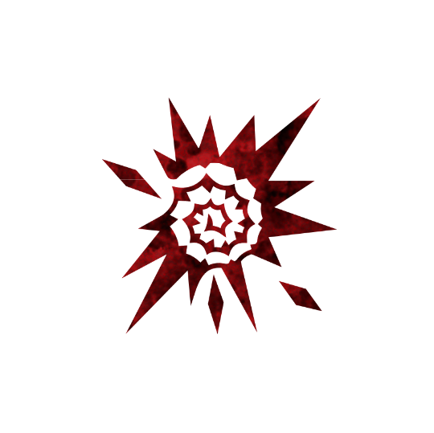

 

# Caetrum
Authors: Jonas, Marcus

## Summary

> Each night*, choose a player; they die, then a potion might break. Evil Potions that break might be received by another player instead.

*Guaranteed to solve any minor problem by turning it into a major disaster.*

The Caetrum is a Demon that increased the amount of evil Potions in play and aggressively removes good Potions from the game.
Its a Demon that is most powerful when the majority of sources of Potions are good.

## How to run

On each execution of a living player if they were holding evil Potions decide if those Potions are to be removed or moved to a different player.

Each night except the first, wake the Caetrum.
They point at any player.
Put the Caetrum to sleep.
That player dies - mark them with the **DEAD** reminder, and decide if evil Potions they were holding should be removed or moved to a different player.
After that decide if you want to break any Potion from any living player.

Whenever an evil Potion breaks, decide if that Potion is to be removed or moved to a different player.

## Examples

Marcus is executed at the end of the day and is holding a Potion of Empathy and a Potion of Terror.
You decide if the Potion of Terror should be removed from the game or if to move it to another living player.
You decide to move it to Jonas.
At this time Jonas receives a Potion of Terror.

Taki the Caetrum kills John during the night.
John was holding a Potion of Apathy.
You decide if the Potion of Apathy should be removed from the game or if to move it to another living player.
You decide to not move it and remove it from the game.
No player receives a Potion of Apathy.
Jan is holding a Potion of Empathy.
You decide to use the Caetrum's ability to destroy this Potion of Empathy.

## Tips & Tricks

- Each night you choose who dies; all of that dying player's potions break, a further potion may break as well, and any evil potion that breaks can jump to another player instead of leaving play.
- The result is that good potions get stripped from the town while evil ones keep spreading, so you are a killer who also poisons the whole potion economy.
- You turn a minor problem into a major disaster when most potions come from good sources, letting the town's own supply pile up as evil potions.
- Aim your kills at players who clear evil potions, such as a Distiller or Toxicologist, so nothing undoes the spread your character causes.
- You still have to survive suspicion, so vary your kills and keep a good-role bluff ready like any other demon.

## Fighting the Caetrum

- A steady loss of good potions paired with evil ones spreading around the town is a strong sign a Caetrum is in play.
- Protect and keep alive your evil-potion cleaners, like the Distiller and Toxicologist, since the Caetrum most wants them dead.
- Do not over-invest in good potions while a Caetrum is suspected, as it can strip them away and turn broken evil potions loose on new players.
- Treat evil potions that keep reappearing on fresh players as the demon's work rather than assuming several separate sources.
- Otherwise hunt it like any demon: track the night kills and work back to who is bluffing a good role.