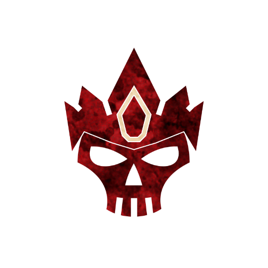

 

# Clofou
Authors: Jonas, Marcus

## Summary

> Each night*, choose a player; they die. The first time you neighbour or trade with a living Outsider, they become evil. [+1 Outsider]

*The saints were his friends, and blessed him; the monsters were his friends, and guarded him.*
