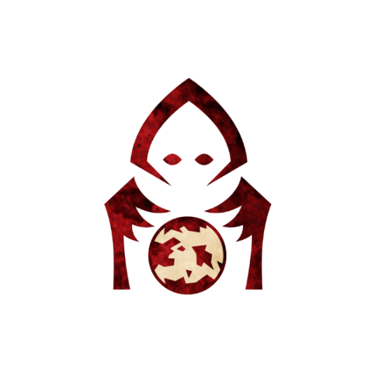

 

# Megalomaniac
Authors: Jonas, Marcus

## Summary

> Each night*, choose a player; they die. Each night, a player might receive a Potion of Panic.

*I believe you find life such a problem because you think there are the good people and the bad people. You're wrong, of course. There are, always and only, the bad people, but some of them are on opposite sides.*

Megalomaniac acts as the scary fast killer of the script.
While decidedly more revealing than the other Demons the Megalomaniac makes up for this with unique synergies with other characters and the potential of acting twice during the night.

## How to run

Each night you decide if a player receives a Potion of Panic or not.

Each night except the first, wake the Megalomaniac.
They point at any player.
Put the Megalomaniac to sleep.
That player dies - mark them with the **DEAD** reminder.

## Tips & Tricks

- You kill every night, making you the fastest killer on the script, so expect to close games quickly but also to draw suspicion faster than other demons.
- Each night a player might receive a Potion of Panic, seeding the Panic that fuels your double kills.
- When a veiled Potion of Panic breaks, you act twice the next night, and two kills in one night can end the game on the spot.
- Think big by leaning on an Aberration or Tramp, who flood the board with Potion of Panic and give you more veiled ones that might break to trigger those double nights.
- Because you kill so aggressively, hold a solid good-role bluff and vary your targets so the town cannot simply follow the bodies back to you.

## Fighting the Megalomaniac

- A kill every single night, and occasionally two, marks a Megalomaniac, so prioritise finding and executing it before it snowballs.
- A veiled Potion of Panic breaking gives it a double kill, so avoid killing or executing likely Panic-holders while a Megalomaniac is suspected.
- Its double nights are fed by the Panic economy, so removing Panic sources like the Aberration or a Tramp slows it down.
- Since it is a revealing demon that has to keep killing, apply pressure early rather than waiting for perfect information.
- Otherwise hunt it like any demon: track the night kills and work back to who is bluffing a good role.