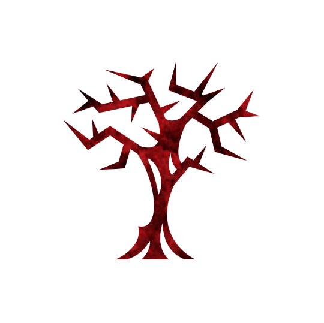

 

# Crone
Authors: Jonas, Marcus

## Summary

> Each night if you traded with an evil player you swap characters. If you traded with a good player you learn their character.

*Why, dearie! You ain't afraid of little old me, are you? Not when there are so much worse things, lurking in the dark?*
