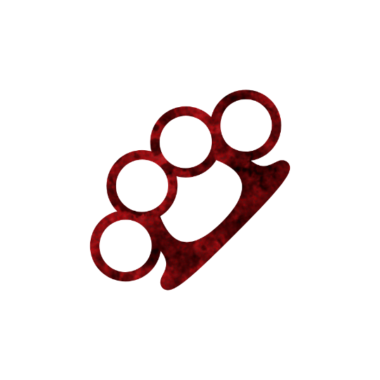

    

# Thug
Authors: Jonas, Marcus

## Summary
> Each night, choose a player and a task. If they do not perform that task tomorrow, a player might receive a potion and a potion might break.

*You're humming, Sam. That means that something awful is going to happen to somebody.*

## How to run
On the first night: Wake up the Thug and have them choose a player and a game related task for that player to perform tomorrow. Put the **THREATENED** reminder token on the chosen player. Put the Thug to sleep. Wake up the chosen player, show them the Thug token and the given Task. Put that player to sleep.

On every other night: If the chosen player did not perform the task yesterday put the **POISONED** reminder token on their good living neighbors. Then wake up the Thug and have them choose a player and a game related task for that player to perform tomorrow. Put the **THREATENED** reminder token on the chosen player. Put the Thug to sleep. Wake up the chosen player, show them the Thug token and the given Task. Put that player to sleep.

1. If you judge that a Task is not fitting for the game you may deny it and make the Thug choose a different Task.
2. If the person cannot perform the Task it is not treated as them failing to perform it.
3. Revealing that the Thug has given you a Task instantly fails the Task.
