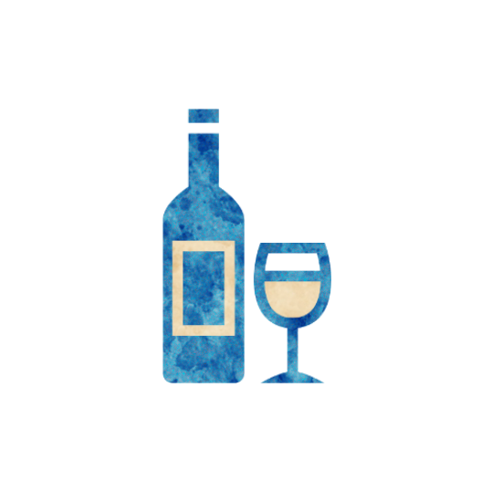

 

# Sommelier
Authors: Jonas, Marcus

## Summary

> Each night one player who would receive a potion might receive one of the opposite alignment instead.

*The discovery of a wine is of greater moment than the discovery of a constellation. The universe is too full of stars.*

The Sommelier acts as a negative force upon the distribution of Potions in the game, causing confusion and increasing the amount of harmful effects.

## How to run
Anytime a player would receive a potion and the Sommelier did not already trigger this night decide if the receiving player should receive a potion of the opposite alignment instead.
If you do, choose any Potion of the opposite alignment that they do not yet hold and put it on them.
If a person for any reason cannot receive a potion of the opposite alignment, this ability cannot trigger upon them.

Potion of Panic is a "special" alignment potion, and therefor has no opposite. It cannot be replaced by the Sommelier.

## Examples

Marcus the Distiller chooses Jonas the Druid.
The Distiller said that Jonas should receive a good Potion but the Sommelier is used to change that potion to an evil one (e.g. Potion of Apathy).

Jonas the Chemist chooses 1. And then chooses Marcus's Potion of Conviction and Sandra's Potion of Panic to be traded.
Marcus receives the Potion of Panic but the Sommelier is used to change the Potion of Conviction to an evil potion (e.g. Potion of Terror).
Any subsequent Potions that are received cannot be changed by the Sommelier this night.