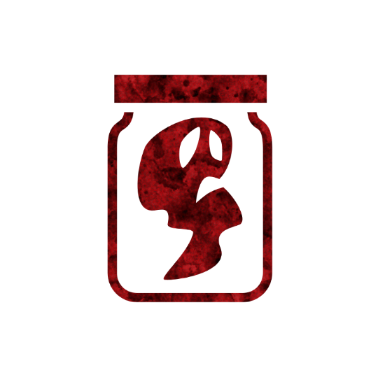

 

# Potion of Disdain
Authors: Jonas, Marcus

## Summary

> Each night*, a player you nominated today might be poisoned until dusk. When this potion is traded it is nullified until dawn.

*I do not HATE you. You don't DESERVE hatred.*

Potion of Disdain adds controlled poisoning to the game, combined with nomination-hesitance and trade-encouragement.

## How to run
Each night remove any **POISONED** reminder passed out by Potion of Disdain.

Each night if a player holding a Potion of Disdain, that was not traded, has nominated a player today the storyteller can decide to poison the nominee.
The storyteller puts down the **POISONED** reminder on the nominee.

## Examples

Hans is holding a Potion of Disdain and decides to nominate Lisa.
Tonight, the Storyteller may put the **POISONED** reminder token on Lisa.

Freddy is holding a Potion of Disdain and decides to nominate Jonas.
Freddy thereafter agrees to a Trade with Susan.
Tonight, if both Susan and Freddy are still alive, the Storyteller cannot put a **POISONED** reminder token on Jonas.

Clara was nominated by Marcus and was not put on the block.
After that Marcus decided to use a Potion of Conviciton to nominate Raúl.
Tonight since Marcus is holding a Potion of Disdain, the storyteller can put the **POISONED** reminder on either Clara or Raúl, but not both.
The storyteller put it on Clara.