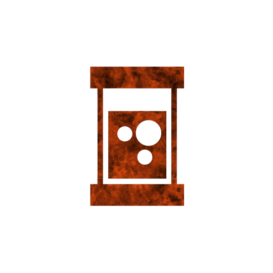

 

# Potion of Panic
Authors: Jonas, Marcus

## Summary

> Cannot be nullified. This potion cannot be veiled once unveiled. When broken, if veiled, the Megalomaniac acts twice next night.

*Has a somewhat greenish-teal hue, unlike the Potion of Pain which is a pinkish purple.*