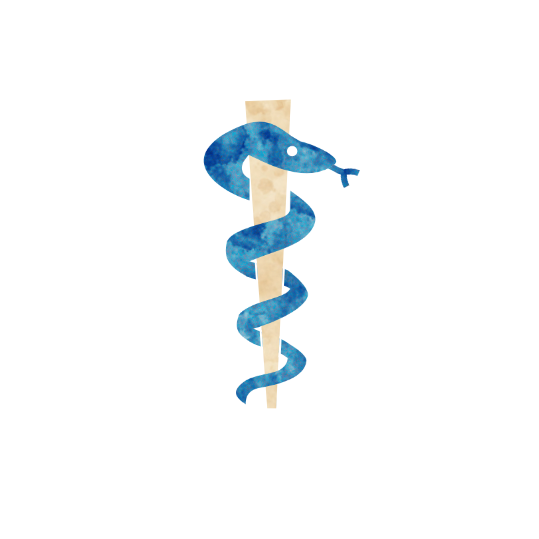

 

# Apothecary
Authors: Jonas, Marcus

## Summary

> All types of potions you are holding are nullified.

*Medicine is not only a science; it is also an art. It does not consist of compounding pills and plasters; it deals with the very processes of life, which must be understood before they may be guided.*