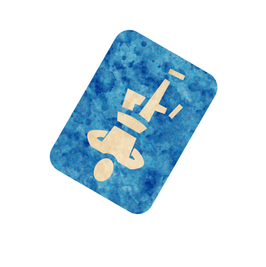

 

# Diviner
Authors: Jonas, Marcus

## Summary

> Each night, a player receives a potion. Once per game at night, when a player would die, their potions break instead.

*People were doubtful about their abilities. The tone quickly changed when they were banned from every local gambling hall.*