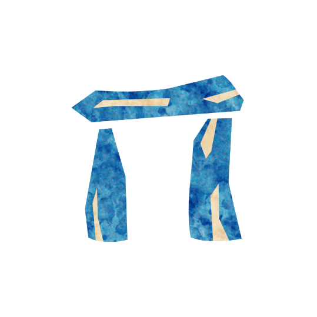

 

# Druid
Authors: Jonas, Marcus

## Summary

> Each night* you may choose a dead player; learn their character type and you might receive an evil potion.

*The greatest use of life is to spend it for something that will outlast it.*

The Druid confirms dead players as the character type they are, at the risk of being saddled with an Evil potion.

## How to run
Each night except the first, wake the Druid and let them choose a dead player.
Tell the Druid the character type the dead player is (Townsfolk, Outsider, Minion, Demon).
Put the Druid back to sleep.

Decide if the Druid should receive an evil Potion based on the information they received, if yes give the Druid an evil Potion.

## Examples
Sandra the Druid wakes up on the 2nd night and chooses Karen the dead Scout.
Sandra learns that Karen was a Townsfolk character.
The Storyteller then chooses for Sandra to receive a Potion of Terror.

Cleo the Druid wakes up and picks Marcus.
Marcus is not dead, so Cleo is told to pick another player.

Ben the Druid wakes up on night 2 and is offered to choose a player.
Ben decides to not choose a player and is then put back to sleep.
The Storyteller may NOT put an Evil potion on Ben since they did not choose a player.

Basti the Druid wakes up and chooses Leo the dead Crone.
Basti is told that Leo was a Minion and is then put back to sleep.
The Storyteller decides to put a Potion of Obsession on Basti.