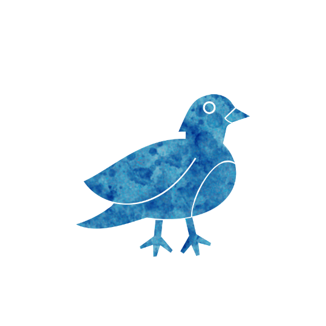

 

# Pigeon Fancier
Authors: Jonas, Marcus

## Summary

> If you died at night, from now on the Glassblower only gives out good potions. [+Glassblower]

*Fancy a pigeon?*

The Pigeon Fancier is a demon trap, a Townsfolk that tilts the game in good's favor if killed at night.

## How to run
During setup put the Glassblower into play.

When the Pigeon Fancier was killed during the night put the 'Active' reminder token on to the Pigeon Fancier.
While doing the Glassblower in the night, keep in mind that they can only give out good Potions from now on.

## Examples
Rita the Caetrum chooses Mark to die at night.
Mark is the Pigeon Fancier, so from this night on the Glassblower Fabled can only give out good potions.

Jonny the Pigeon Fancier was executed during the day.
Jonny was not marked with the 'Active' reminder token.