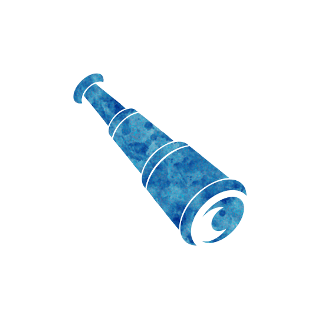

 

# Scout
Authors: Jonas, Marcus

## Summary

> You start knowing the length of your chain of Townsfolk. [+0/+1 Outsider]

*Var redo! Alltid redo!*

The scout is a powerful 1st night character, giving a major clue to possible locations of the evil team.

## How to run
During the first night, wake up the Scout.
Show them a number correlating with the number ot townsfolk sitting left and right to them +1.
Put them back to sleep.

## Examples
Max the Scout wakes up on the first night and learns a 3.
That is because their left-side neighbor is the Chemist, 
and the 2 players to their right are the Farrier and the Toll Inspector.

Henry the Scout wakes up on the first night and learns a 1.
That is because he is sitting right in between the 2 Outsiders of the game.

## Tips & Tricks

- Your number is the size of the unbroken run of Townsfolk that includes you, flanked on both sides by a non-Townsfolk - an Outsider, Minion, Demon, or Traveller.
- A short chain means company nearby: a low number means a non-Townsfolk is sitting close to you on one or both sides, while a high number tells you a large block of Townsfolk surrounds you and evil is seated elsewhere.
- Account for the Outsider count, as the [+0/+1 Outsider] setup can add an Outsider that shortens your chain without an evil player being anywhere near you.
- Always be prepared to be wrong: if you were made drunk or poisoned on the first night - say a veiled Potion of Panic from the Tramp or a Potion of Stress - your number can be off, so treat it as a strong lead rather than a certainty.
- Telling the town your number helps them place the seating, but it also points the evil team straight at you, so time your reveal.

## Bluffing as the Scout

- The Scout only acts on the first night, so you never have to invent ongoing night information.
- Claim a number that fits the real seating and a plausible Outsider count, working out what a genuine Scout in your seat would learn so a real Scout or a little seating math does not expose you.
- You break the chain yourself; every evil player, Traveller, and Outsider ends a run of Townsfolk, so a real Scout seated near you learned a small number pointing your way - do not claim a number that contradicts that.
- The [+0/+1 Outsider] setup makes shorter chains believable and gives a modest claimed number an easy explanation.
- Coordinate with your team so two of you do not both claim Scout or produce seating counts that contradict each other.