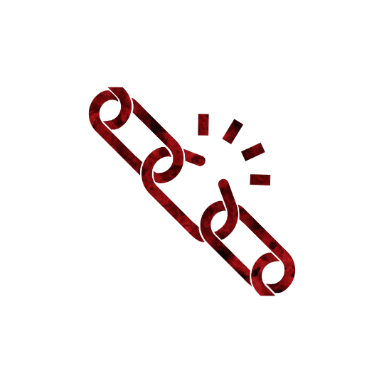
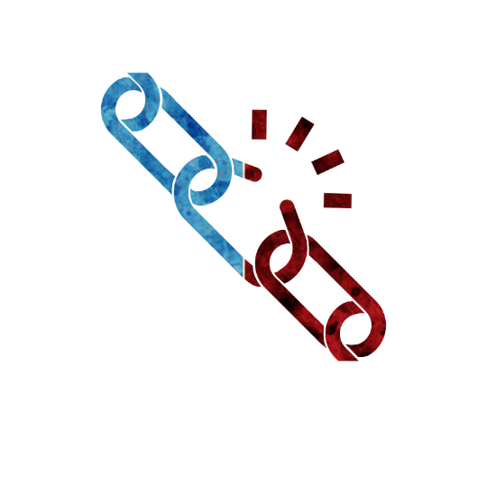

 

# Fugitive
Authors: Jonas, Marcus

## Summary

> Each night* 2 players choose either 1) The other receives a Good potion, or 2) to learn the other and their potions. If both choose 2, each receive an Evil potion instead.

*I've run so far away,\
I ran all night and day,\
so far away,\
but I couldn't get away.*