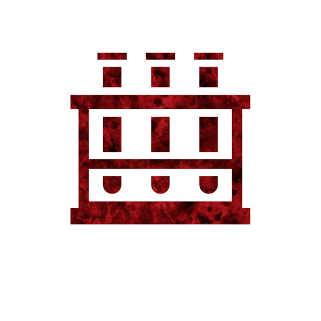
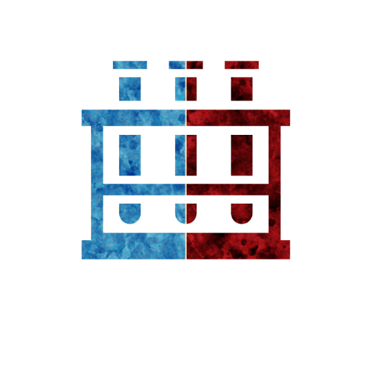

 

# Toxicologist
Authors: Jonas, Marcus

## Summary

> Each night eye the cauldron, choose 2 living players (not yourself); a potion one of them holds break.

*Exposure to toxins in our environment can have serious health consequences, so it’s important to take steps to minimize our exposure.*

The Toxicologist removes potions from the board, either clearing harmful potions or robbing the good team of beneficial ones.

## How to run
Each night wake up the Toxicologist and show them the Cauldron.
Let them choose 2 alive players.
Put the Toxicologist back to sleep.
One Potion either player holds breaks.

## Examples
Gustav the Toxicologist wakes up and is shown the Cauldron.
He then chooses Ricky and Martin, two other living players.
Ricky is holding 2 potions and Martin is holding 1 potion.
The Storyteller chooses 1 of those 3 potions to break.